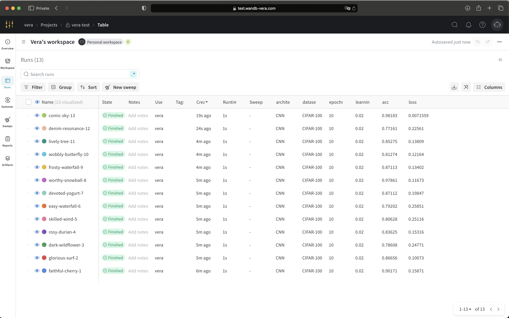

# Weights & Biases Self-Hosted Server Deployment

## Overview  
Quickstart on how to self-deploy Weights & Biases (W&B) Server on GCP using Terraform. 

By following this guide you will have:
	•	A GKE cluster running W&B in GCP
	•	A public HTTPS endpoint at https://<subdomain>.<domain> with a valid certificate
	•	A Cloud Storage bucket for experiment data
	•	A demo W&B project with ≥10 runs to validate that everything works

**References:**  
- Official self-hosted GCP guide: https://docs.wandb.ai/guides/hosting/self-managed/gcp-tf/  
- W&B Terraform module: https://registry.terraform.io/modules/wandb/wandb/google  

Additional notes and caveats are mentioned in each section. This approach aims to minimize troubleshooting and infrastructure changes. There may be other approaches that are more suitable towards your use case and environment. 

---

## Contents  
- `terraform/` – Terraform code  
- `screenshots/infrastructure` – GCP Infrastructure images
- `screenshots/readme` – Reference images for README.md 
- `scripts/demo_runs.py` - Python script that logs an example run to your new W&B instance
- `README.md` – Deployment guide

---

## Prerequisites  
- GCP project connected to a billing account
- Terraform v1.0+  
- `gcloud` CLI authenticated  
- Python & `wandb` SDK 
- Registered domain name with a matching DNS hosted zone 

---

## Quickstart

### 1. Create variables.tf, terraform.tfvars, and main.tf files. 

For main.tf, ensure you're pulling the latest version of the wandb module. Example: version = "~> 9.0"

### 2. Populate the terraform.tfvars file. 

| Variable             | Type    | Description                                        |
|----------------------|---------|----------------------------------------------------|
| `project_id`         | string  | Your GCP project ID                                |
| `region`             | string  | GCP region (e.g. `us-central1`)                    |
| `zone`               | string  | GCP zone (e.g. `us-central1-a`) for zonal resources|
| `subdomain`          | string  | Subdomain for your W&B host (e.g. `wandb`)         |
| `domain_name`        | string  | Your registered domain (e.g. `example.com`)        |
| `gke_min_node_count` | number  | Min GKE node-count (optional)                      |
| `gke_max_node_count` | number  | Max GKE node-count (optional)                      |
| `license`            | string  | W&B Enterprise license key                         |

**⸻ Notes & Limitations ⸻**

**Region and Zone** 
- Consider choosing a less-contended GCP region when possible. Otherwise, you may encounter a resource constraint error (GCE_STOCKOUT). Keep in mind that  specifying a single `zone` does not mean that your resources will only be provisioned in that zone.

By default, the module deploys a regional GKE cluster with balanced auto-scaling (multi-zonal). As seen in the example below, we ran into errors for other zones, even though our tfvars file only had one zone explicitly listed. 


**Domain and Subdomain** 
- You must have a registered Domain Name and subdomain record in order for Google's Managed Certificate to be successfully activated. 

**GKE Node Count** 
- You may hit a quota limit on "Persistent Disk SSD (GB)". If you are on GCP free tier, this quota cannot be increased beyond the standard amount of 500 GB. See below for a workaround. 


If you encounter this error without specifying a deployment size, then you must manually override the Cluster Sizing in your terraform.tfvars. This is because the deployment size for W&B already defaults to the lowest level (small). Since we cannot set a lower level for cluster size, individual cluster parameters must be adjusted instead. 

For this purposes of this deployment, the GKE node counts were adjusted. Based on the GCP TFE Module documentation, each GKE node consumes 100 GB for the node root volume (assuming all other parameters are unchanged). 


Therefore, the maximum node count was set to 5 nodes, thus ensuring that the total GB used remains under the free tier quota limit of 500 GB. 

Please note that specifying minimum and maximum GKE nodes will also prevent the cluster from auto-scaling beyond the set amounts. 

If desired, you could also change these size values: redis_memory_size_gb, database_machine_type, gke_machine_type


**W&B License** 
- You must have a valid license code, or you will experience errors while navigating your W&B UI. A free trial of this license can be obtained here: https://wandb.ai/site/enterprise-trial/.


### 3.	Terraform Initialize & plan

```terraform init```
```terraform plan -var-file=terraform.tfvars```

Review the proposed changes to ensure that the resources are being created, updated, or deleted as expected. 

### 4.	Terraform Apply

After you've confirmed the terraform plan, you can apply the plan.  

```terraform apply -var-file=terraform.tfvars```

### 5. Note the outputs (url, address, bucket_name)

Your output should look similar to the following: 

Outputs:

url = "https://wandb.my-domain.com"
address = "34.237.13.125"
bucket_name = "wandb-my-domain-data"

⸻

### 6. Verification. 
 
- Navigate to the W&B UI using the URL from the terraform output above. 

If you are unable to access the page, check your GCP loadbalancer certificate: 


**Network Services > Loadbalancing > Select your Loadbalancer > Frontend > Select the certificate next to HTTPS.**

If the status shows "Provisioning", GCP is still trying to verify the domain. Once the certificate shows as "Active", you should be able to reach your URL with a secure HTTPS connection. 

- Once the page loads, you will be prompted to create an account or sign in.

- From there, follow the instructions to programatically authenticate to W&B and your simulate your first run. Note that you may need to create a project first to ensure a successful run.

- Generate ≥10 runs using the [demo runs script](scripts/demo_runs.py)

- Confirm that the runs appear under the project that you created. 



⸻

### 7. Helm & Operator Verification

Although the Terraform module handles installing the W&B Helm chart via the operator, there are some additional verifications checks you can run:

-  **Confirm operator is running**  
   ```bash
   kubectl -n wandb get pods -o wide --show-labels

You should see a pod that starts with `wandb-controller-manager`

-  **Tail its logs to watch reconciliation:**
kubectl -n wandb logs deploy/wandb-controller-manager --follow

Look for a line like the following: 

```"Successfully applied spec","controller":"weightsandbiases"``` 

**Confirm components are running:**
kubectl -n default get deployments,sts

You should see your deployments all READY, for example: 


These checks confirm that the operator pulled the chart, rendered all templates, and applied them successfully in the cluster.

⸻

### Recommended next steps for Infrastructure Optimization
	•	Fine-tune node pools & autoscaling (e.g. ramp up GKE node types in prod)
	•	Enable monitoring & alerting (e.g. Cloud Monitoring Alerts integrated with external channels such as Slack to monitor Loadbalancer health checks and errors)
	•	Explore additional module inputs (e.g. Redis Cache for faster application response times)

⸻

### Appendix: Infrastructure and platform screenshots

For a deeper look at the Terraform-provisioned infrastructure and the fully running W&B UI, see the screenshot folders in this repo:

[infrastructure](screenshots/infrastructure)  – VPC, GKE cluster, load balancer, DNS setup, Pub/Sub, etc.
[platform](screenshots/platform) – W&B home page, system console, health dashboard, and demo runs.

⸻

This project demonstrates alignment with Weights & Biases' core values: 

- **Grit**: Overcame GKE SSD quota shortages, regional zone capacity constraints, load-balancer DNS/TLS challenges, and licensing integration issues to deliver a stable deployment.
- **Curiosity**: Explored multiple access patterns (nip.io, port-forwarding, custom DNS), dove into cluster-level troubleshooting with `kubectl`—inspecting pod health, service endpoints, LoadBalancer IPs and logs—studied the W&B Helm chart and operator internals to understand how CRDs and controllers wire up the UI and backend, and evaluated post-deployment infrastructure optimizations.  
- **Honesty**: Documented errors and workarounds to guide future users. 
- **Gumption**: Quick delivery of a fully functional self-hosted W&B stack in GCP on first attempt

Thank you for reviewing my work!
Please feel free to reach out to me with any questions. 

